The Infoblox Portal can be configured to manage DNS and IPAM data from public cloud providers like AWS, Azure, and GCP.

Complete the following steps to sync DNS  data from AWS and Azure.

## 1) Login to your cloud account consoles
===
Using the credentials below, login to the AWS and Azure Web Consoles in their respective tabs above:

---
# AWS Credentials ☁️

Select "IAM Account" and enter the **AWS ID**:
```
[[ Instruqt-Var key="INSTRUQT_AWS_ACCOUNT_INFOBLOX_DEMO_ACCOUNT_ID" hostname="shell" ]]
```

**AWS Username**
```
[[ Instruqt-Var key="INSTRUQT_AWS_ACCOUNT_INFOBLOX_DEMO_USERNAME" hostname="shell" ]]
```

**AWS Password**
```
[[ Instruqt-Var key="INSTRUQT_AWS_ACCOUNT_INFOBLOX_DEMO_PASSWORD" hostname="shell" ]]
```

---

# AZURE Credentials ☁️

**AZURE SUBSCRIPTION**
```
[[ Instruqt-Var key="INSTRUQT_AZURE_SUBSCRIPTION_INFOBLOX_TENANT_SUBSCRIPTION_ID" hostname="shell" ]]
```

**AZURE USERNAME**
```
[[ Instruqt-Var key="INSTRUQT_AZURE_SUBSCRIPTION_INFOBLOX_TENANT_USERNAME" hostname="shell" ]]
```

**AZURE PASSWORD**
```
[[ Instruqt-Var key="INSTRUQT_AZURE_SUBSCRIPTION_INFOBLOX_TENANT_PASSWORD" hostname="shell" ]]
```


## 2) Onboarding AWS account onto Infoblox Portal
===

Before integrating AWS Route 53 with Universal DDI, you must first define the type of AWS Route 53 deployment you are using. Defining the type of AWS Route 53 deployment is required since each type of deployment has different configuration parameters that will be used while configuring network discovery in Universal DDI.

We are going to use -> Account Preference: Auto-Discover Multiple (Recommended)/Type of Access: Principal ID + Role ARN

### Step-by-Step Guide: AWS Discovery Configuration via Infoblox Portal

#### 1. Retrieve Required Identifiers

To proceed with the AWS Discovery configuration, you will need the following information:
	•	Principal ID
	•	External ID

Ensure you have this information available before continuing.

#### 2. Access the Infoblox Portal
Navigate to the Infoblox Portal.
From the top navigation menu, go to:
Configure → Networking → Discovery.

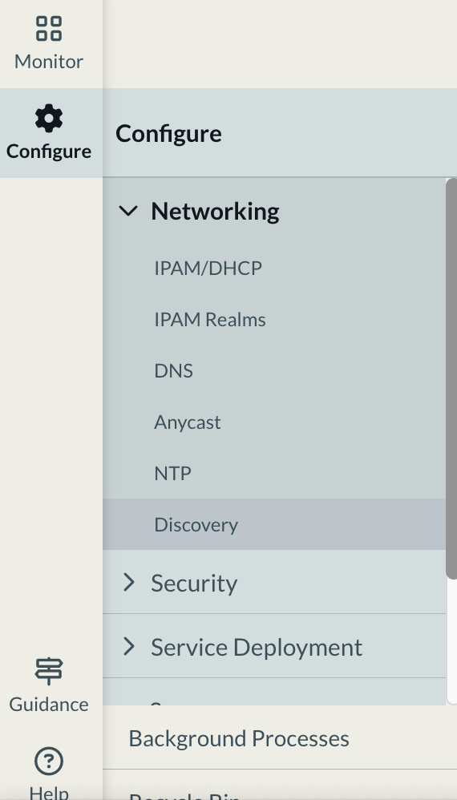


#### 3. Configure AWS Discovery
1.	Within the Discovery section, select the Cloud tab.
2.	Click on Create AWS to begin setting up cloud discovery for AWS.

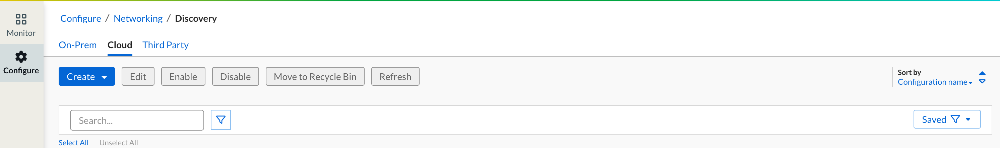

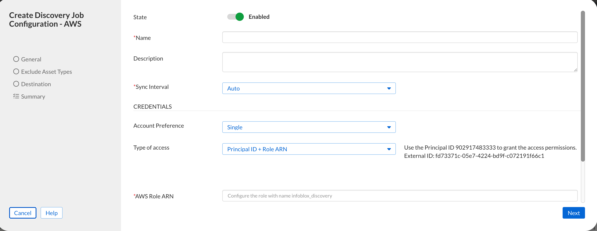

NOTE: Gather information from the portal about External ID and Principal ID.

#### 4. Go to the AWS Discovery Page in Instruqt and click on Deploy to AWS.

#### 5. Log in to the console using the CSP credentials provided in "Section 1".

#### 6. Provide a name for the CloudFormation stack and enter the External ID captured in the previous steps.


> 	 > [!NOTE]
> Note: Leave the Account ID unchanged and COPY/PASTE External ID from the Infoblox Portal.


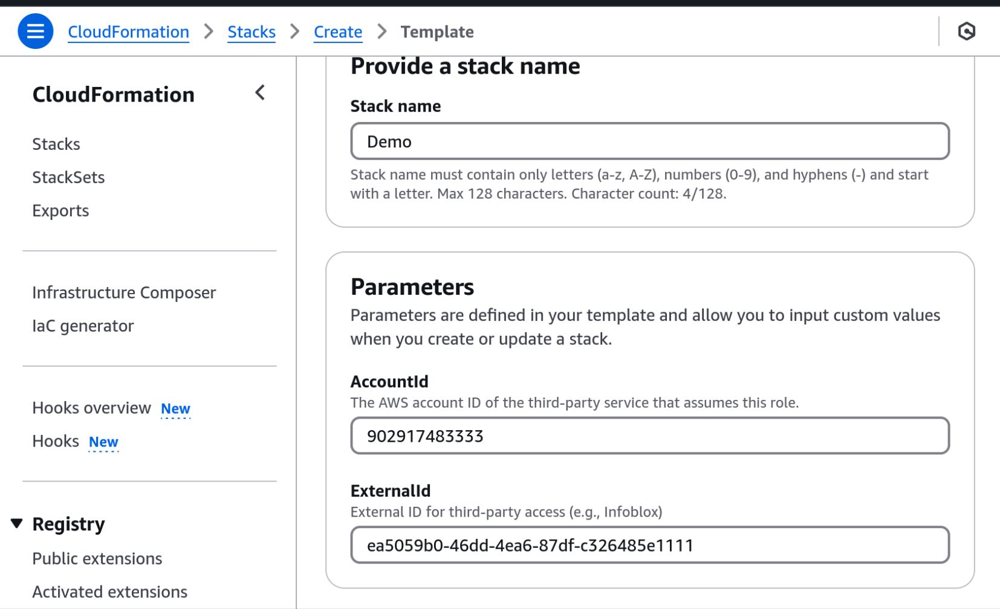


#### 7.Click "Next" on each page, keeping all settings at their default values.

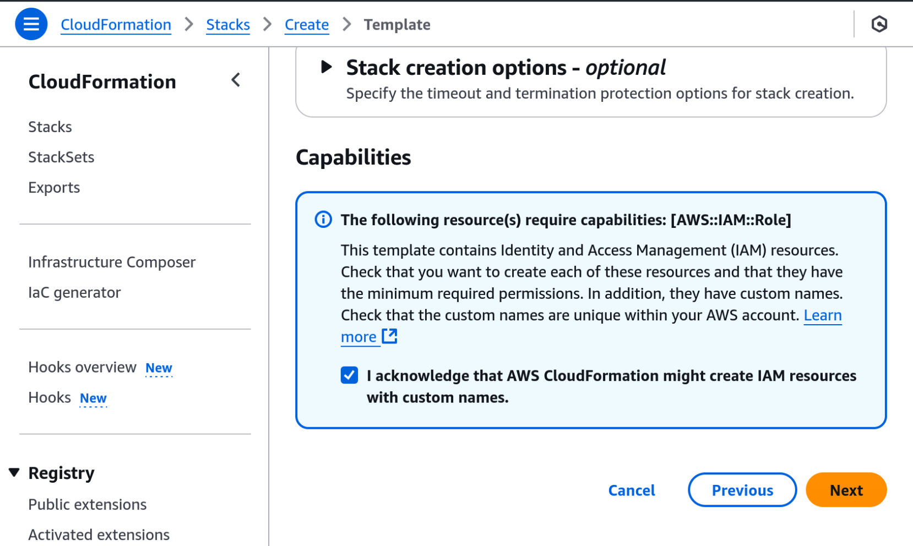

#### 8.Click "Submit" on the next page

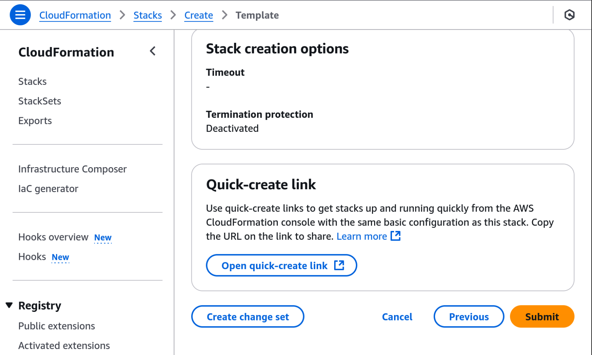


#### 9.Wait for the CloudFormation stack creation to complete, then navigate to the "Outputs" tab to retrieve the ARN value.

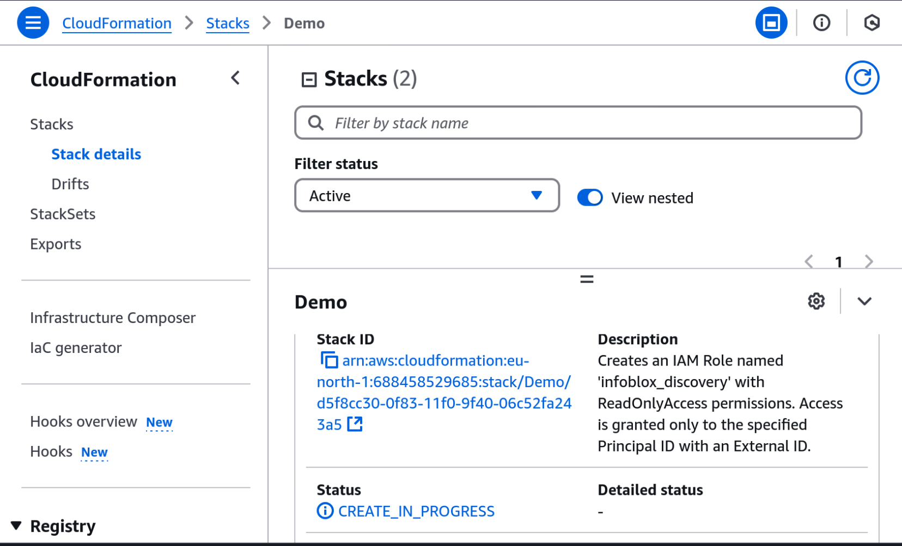

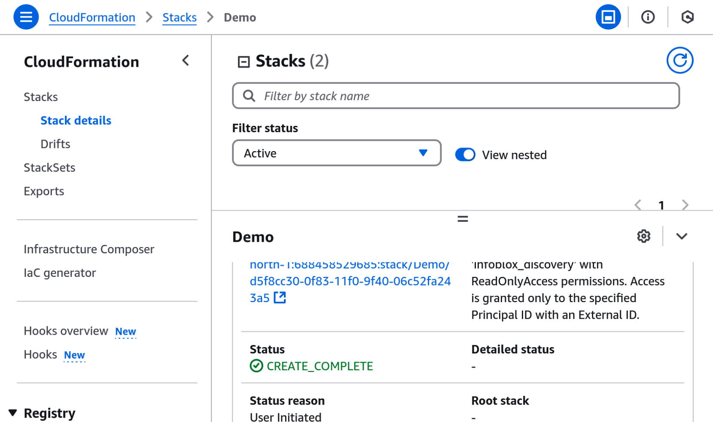

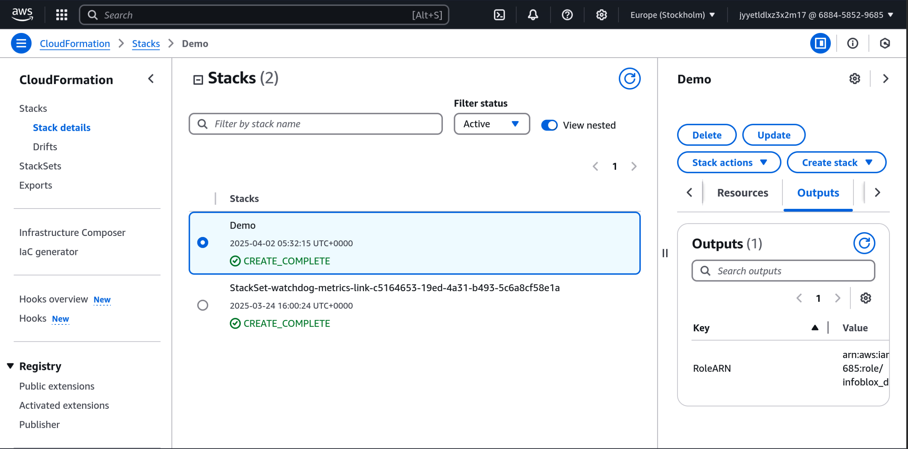


#### 10.Return to the Infoblox Portal where you initiated the AWS Discovery Job, paste the retrieved ARN value into the appropriate field, and click "Next" to proceed.

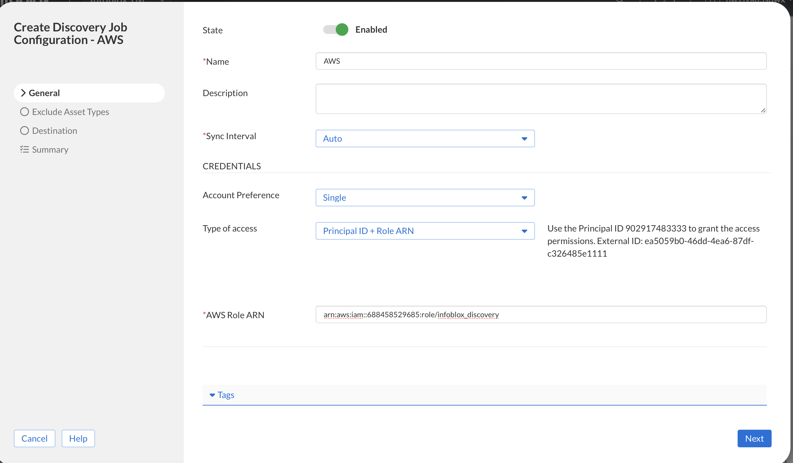

#### 11.On the next page, configure the settings to match those shown in the screenshot below, then click "Next" to continue.

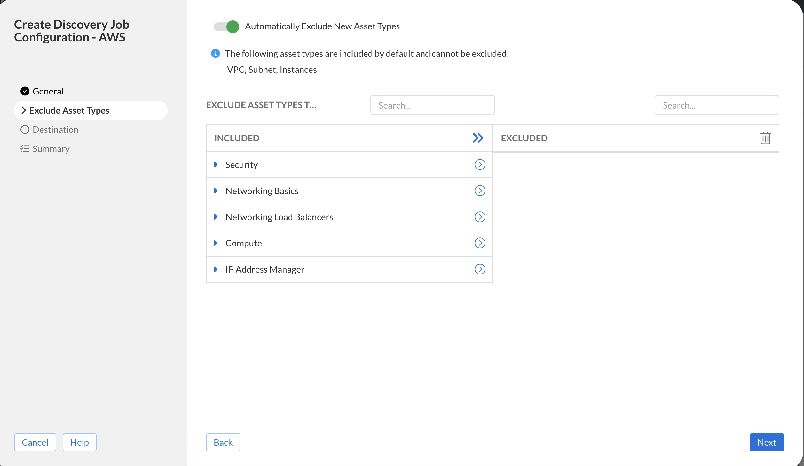

#### 12.On the next page, configure the settings to match those shown in the screenshot below, then click "Next" to continue.

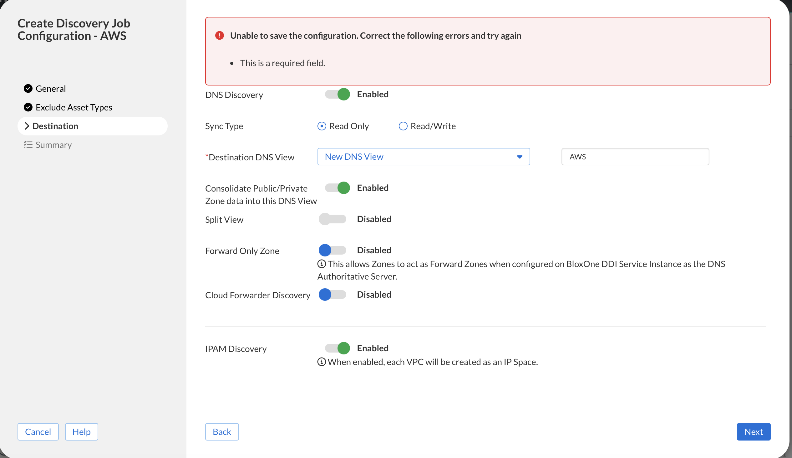

#### 13.On the next page, configure the settings to match those shown in the screenshot below, then click "Save&Close" to continue.

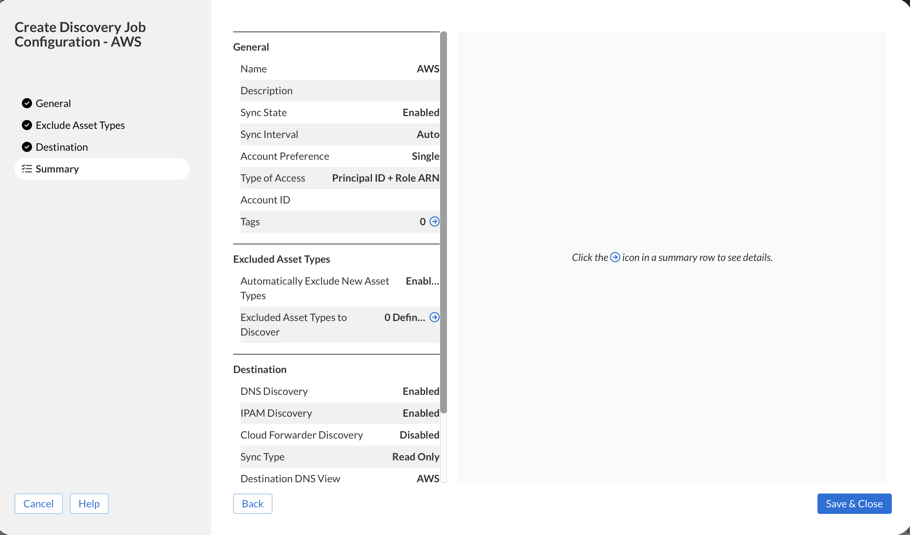


## 3) Onboarding Azure account onto Infoblox Portal
===

Azure DNS is a cloud DNS web service that routes end users’ requests to internet applications and resources by resolving domain names into IP addresses and IP addresses into domain names. In Azure, DNS records are organized into hosted zones, which are configured through the Azure API, Azure CLI, or Azure Resource Manager.

Universal DDI provides the capability for synchronizing and integrating public-hosted zones with Azure, and this allows users to view and manage Azure DNS data through the Infoblox Portal. Also, BloxOne NIOS-X Servers can be configured to service zones synchronized from Azure.


The Infoblox Azure DNS integration feature offers the following:

Two-way synchronization of public-hosted zones and records between Azure and Universal DDI after the initial configuration and sync is complete. Synchronization of Azure DNS resource records configured with a simple routing policy is supported. Other routing policies are not supported. Synchronization of DNSSEC records is not supported.

One-way synchronization of private zones from Azure DNS to Universal DDI. The synchronized zones are read-only.

Viewing and management of Azure-NIOS-X hosted zones and records through the Infoblox Portal.

A NIOS-X Server can directly respond to DNS queries from clients for private zones that are managed in Azure. A NIOS-X Server can be configured as a secondary DNS server for local clients thereby reducing the network load since the queries do not need to recurse to Azure DNS.

### Step-by-Step Guide: AWS Discovery Configuration via Infoblox Portal

#### 1. Navigate to the Infoblox Portal and go to Configure → Administrator → Credentials.

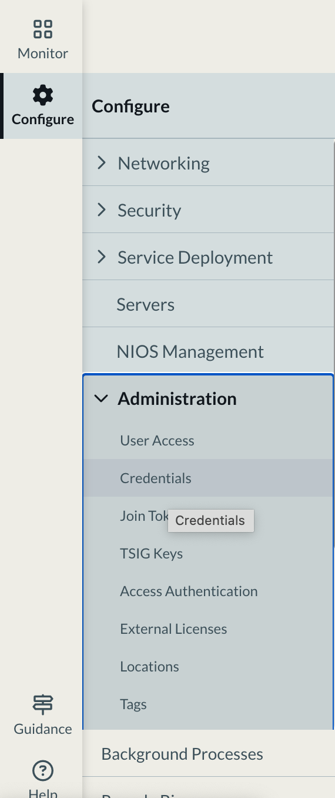

#### 2. Click Create and select Microsoft Azure from the dropdown menu.

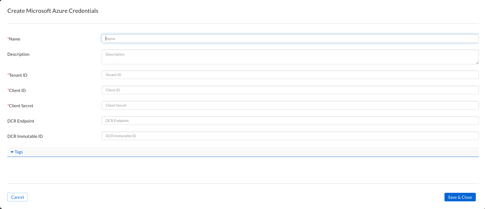


#### 3. Fill in all required fields marked with an asterisk (*) using the details provided below and click "Save&Close".

> [!IMPORTANT]
> NOTE: Please do not forget to give it a Name at the top.


**AZURE Tenant ID**
```
[[ Instruqt-Var key="INSTRUQT_AZURE_SUBSCRIPTION_INFOBLOX_TENANT_TENANT_ID" hostname="shell" ]]
```

**AZURE Client ID**
```
[[ Instruqt-Var key="INSTRUQT_AZURE_SUBSCRIPTION_INFOBLOX_TENANT_SPN_ID" hostname="shell" ]]
```

**AZURE Client Secret**
```
[[ Instruqt-Var key="INSTRUQT_AZURE_SUBSCRIPTION_INFOBLOX_TENANT_SPN_PASSWORD" hostname="shell" ]]
```


#### 4. Access the Infoblox Portal

1.	Navigate to the Infoblox Portal
2.	From the top navigation menu, go to:

Configure → Networking → Discovery.


#### 5. Configure Azure Discovery
1.	Within the Discovery section, select the Cloud tab.
2.	Click on Create AWS to begin setting up cloud discovery for Azure.


#### 6. Fill in all required fields marked with an asterisk (*) using the details provided below.

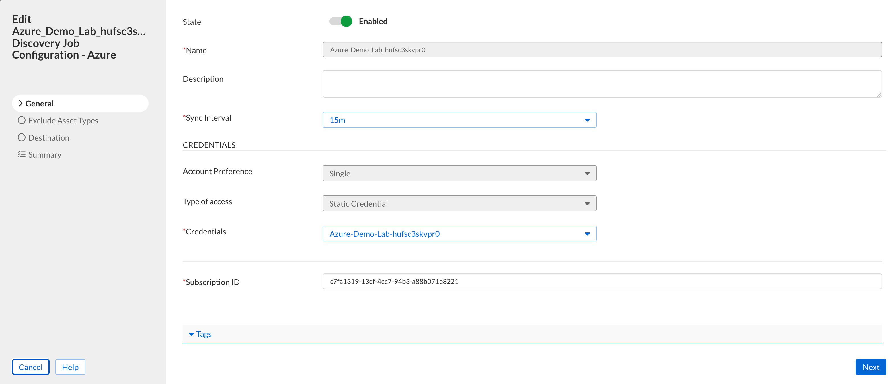

> [!IMPORTANT]
> Please give it a name and Select "Type of Access" -> Static ------->  under" Credentials" select the one you have created in the previous step.

Azure subscription id can be found below.

**AZURE SUBSCRIPTION ID**
```
[[ Instruqt-Var key="INSTRUQT_AZURE_SUBSCRIPTION_INFOBLOX_TENANT_SUBSCRIPTION_ID" hostname="shell" ]]
```

#### 7.On the next page, configure the settings to match those shown in the screenshot below, then click "Next" to continue.

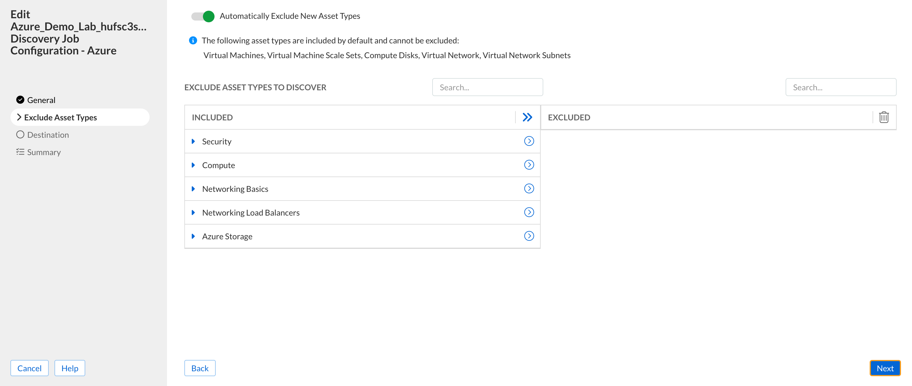

#### 8.On the next page, configure the settings to match those shown in the screenshot below, then click "Next" to continue.

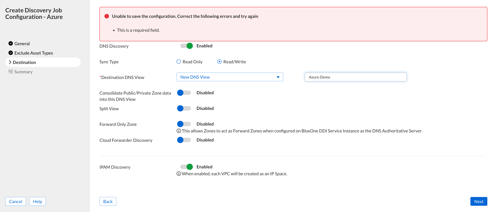

#### 9.On the next page, configure the settings to match those shown in the screenshot below, then click "Save&Close" to continue.

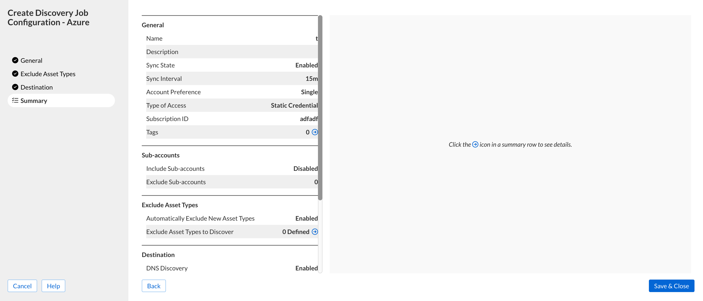
