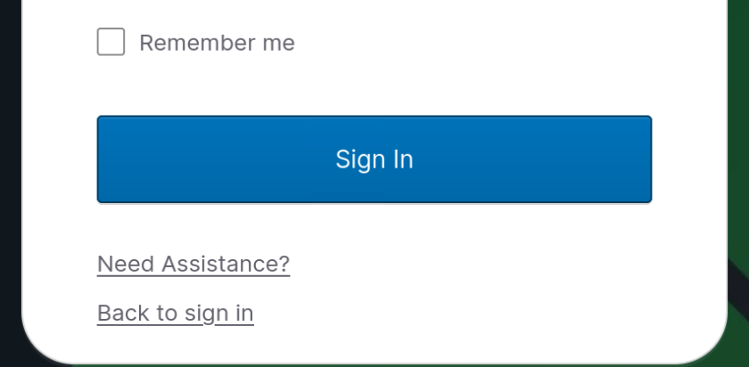

# Welcome to Infoblox UDDI Lab 🎓

This is an **on-demand learning lab** built to help you get hands-on experience with **Infoblox Universal DNS Management (UDDI)** — a modern, cloud-delivered solution for managing DNS, DHCP, and IPAM across hybrid and multicloud environments.

Each student receives a **dedicated sandbox** with:
- Real **AWS**, **Azure**, and **GCP** cloud accounts
- Pre-provisioned infrastructure and cloud-native resources
- Fully isolated access to run and test each scenario

  

## 📚 Lab Structure

The lab consists of **three progressive challenges**, structured as directories:
- `01-review-architecture-and-deploy-resources`
- `02-managing-csps`
- `03-quiz-infoblox`

Each challenge must be completed in order. Inside each folder, you'll find an `assignment.md` with a clear storyline, tasks, and user guidance.

## ✅ Getting Started

1. Navigate to the `01-review-architecture-and-deploy-resources` directory.
2. Open the `assignment.md` file to begin your first challenge.
3. Follow the instructions provided to complete each step before moving to the next one.

> 🛠️ Note: This lab runs in real cloud environments. Please treat your resources with care — no crypto mining, please 😄

---

Happy learning, and welcome to the world of **cloud-native DDI with Infoblox**!

---

**#Infoblox #UDDI #CloudNetworking #DNS #HandsOnLabs #AWS #Azure #GCP**
